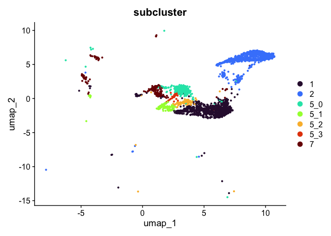

# Introduction to Single Cell RNA-Seq Part 6: Clustering and cell type assignment
Clustering and cell type assignment are critical steps in many single cell (or single nucleus) experiments. The power of single cell experiments is to capture the heterogeneity within samples as well as between them. Clustering permits the user to organize cells into clusters that correspond to biologically and experimentally relevant populations.


## Set up workspace

``` r
library(Seurat)
library(kableExtra)
library(tidyr)
library(dplyr)
library(ggplot2)
library(HGNChelper)
library(ComplexHeatmap)
set.seed(12345)
experiment.aggregate <- readRDS("scRNA_workshop-04.rds")
experiment.aggregate
```

```
## An object of class Seurat 
## 11474 features across 6315 samples within 1 assay 
## Active assay: RNA (11474 features, 7110 variable features)
##  3 layers present: counts, data, scale.data
##  2 dimensional reductions calculated: pca, umap
```

## Construct network
Seurat implements an graph-based clustering approach. Distances between the cells are calculated based on previously identified PCs.

The default method for identifying k-nearest neighbors is [annoy](https://github.com/spotify/annoy), an approximate nearest-neighbor approach that is widely used for high-dimensional analysis in many fields, including single-cell analysis. Extensive community benchmarking has shown that annoy substantially improves the speed and memory requirements of neighbor discovery, with negligible impact to downstream results.

``` r
experiment.aggregate <- FindNeighbors(experiment.aggregate, reduction = "pca", dims = 1:50)
```

## Find clusters
The FindClusters function implements the neighbor based clustering procedure, and contains a resolution parameter that sets the granularity of the downstream clustering, with increased values leading to a greater number of clusters. This code produces a series of resolutions for us to investigate and choose from.

The clustering resolution parameter is unit-less and somewhat arbitrary. The resolutions used here were selected to produce a useable number of clusters in the example experiment. 

``` r
experiment.aggregate <- FindClusters(experiment.aggregate,
                                     resolution = seq(0.1, 0.4, 0.1))
```

```
## Modularity Optimizer version 1.3.0 by Ludo Waltman and Nees Jan van Eck
## 
## Number of nodes: 6315
## Number of edges: 259289
## 
## Running Louvain algorithm...
## Maximum modularity in 10 random starts: 0.9690
## Number of communities: 10
## Elapsed time: 0 seconds
## Modularity Optimizer version 1.3.0 by Ludo Waltman and Nees Jan van Eck
## 
## Number of nodes: 6315
## Number of edges: 259289
## 
## Running Louvain algorithm...
## Maximum modularity in 10 random starts: 0.9494
## Number of communities: 11
## Elapsed time: 0 seconds
## Modularity Optimizer version 1.3.0 by Ludo Waltman and Nees Jan van Eck
## 
## Number of nodes: 6315
## Number of edges: 259289
## 
## Running Louvain algorithm...
## Maximum modularity in 10 random starts: 0.9343
## Number of communities: 14
## Elapsed time: 0 seconds
## Modularity Optimizer version 1.3.0 by Ludo Waltman and Nees Jan van Eck
## 
## Number of nodes: 6315
## Number of edges: 259289
## 
## Running Louvain algorithm...
## Maximum modularity in 10 random starts: 0.9224
## Number of communities: 17
## Elapsed time: 0 seconds
```

Seurat adds the clustering information to the metadata table. Each FindClusters call generates a new column named with the assay, followed by "_snn_res.", and the resolution.

``` r
cluster.resolutions <- grep("res", colnames(experiment.aggregate@meta.data), value = TRUE)
head(experiment.aggregate@meta.data[,cluster.resolutions]) %>%
  kable(caption = 'Cluster identities are added to the meta.data slot.') %>%
  kable_styling("striped")
```

<table class="table table-striped" style="margin-left: auto; margin-right: auto;">
<caption>Cluster identities are added to the meta.data slot.</caption>
 <thead>
  <tr>
   <th style="text-align:left;">  </th>
   <th style="text-align:left;"> RNA_snn_res.0.1 </th>
   <th style="text-align:left;"> RNA_snn_res.0.2 </th>
   <th style="text-align:left;"> RNA_snn_res.0.3 </th>
   <th style="text-align:left;"> RNA_snn_res.0.4 </th>
  </tr>
 </thead>
<tbody>
  <tr>
   <td style="text-align:left;"> AAACCCAAGTTATGGA_A001-C-007 </td>
   <td style="text-align:left;"> 1 </td>
   <td style="text-align:left;"> 1 </td>
   <td style="text-align:left;"> 2 </td>
   <td style="text-align:left;"> 10 </td>
  </tr>
  <tr>
   <td style="text-align:left;"> AAACGCTTCTCTGCTG_A001-C-007 </td>
   <td style="text-align:left;"> 6 </td>
   <td style="text-align:left;"> 7 </td>
   <td style="text-align:left;"> 9 </td>
   <td style="text-align:left;"> 13 </td>
  </tr>
  <tr>
   <td style="text-align:left;"> AAAGAACGTGCTTATG_A001-C-007 </td>
   <td style="text-align:left;"> 1 </td>
   <td style="text-align:left;"> 1 </td>
   <td style="text-align:left;"> 4 </td>
   <td style="text-align:left;"> 5 </td>
  </tr>
  <tr>
   <td style="text-align:left;"> AAAGAACGTTTCGCTC_A001-C-007 </td>
   <td style="text-align:left;"> 3 </td>
   <td style="text-align:left;"> 3 </td>
   <td style="text-align:left;"> 3 </td>
   <td style="text-align:left;"> 3 </td>
  </tr>
  <tr>
   <td style="text-align:left;"> AAAGAACTCTGGCTGG_A001-C-007 </td>
   <td style="text-align:left;"> 4 </td>
   <td style="text-align:left;"> 5 </td>
   <td style="text-align:left;"> 7 </td>
   <td style="text-align:left;"> 8 </td>
  </tr>
  <tr>
   <td style="text-align:left;"> AAAGGATTCATTACCT_A001-C-007 </td>
   <td style="text-align:left;"> 3 </td>
   <td style="text-align:left;"> 3 </td>
   <td style="text-align:left;"> 3 </td>
   <td style="text-align:left;"> 3 </td>
  </tr>
</tbody>
</table>

## Explore clustering resolutions
The number of clusters produced increases with the clustering resolution.

``` r
sapply(cluster.resolutions, function(res){
  length(levels(experiment.aggregate@meta.data[,res]))
})
```

```
## RNA_snn_res.0.1 RNA_snn_res.0.2 RNA_snn_res.0.3 RNA_snn_res.0.4 
##              10              11              14              17
```

### Visualize clustering

Dimensionality reduction plots can be used to visualize the clustering results. On these plots, we can see how each clustering resolution aligns with patterns in the data revealed by dimensionality reductions.

#### UMAP


``` r
# UMAP colored by cluster
lapply(cluster.resolutions, function(res){
  DimPlot(experiment.aggregate,
          group.by = res,
          reduction = "umap",
          shuffle = TRUE) +
    scale_color_viridis_d(option = "turbo")
})
```

```
## [[1]]
```

<!-- -->

```
## 
## [[2]]
```

<!-- -->

```
## 
## [[3]]
```

<!-- -->

```
## 
## [[4]]
```

<!-- -->

### Investigate the relationship between cluster identity and sample identity


``` r
lapply(cluster.resolutions, function(res){
         tmp = experiment.aggregate@meta.data[,c(res, "group")]
         colnames(tmp) = c("cluster", "group")
         ggplot(tmp, aes(x = cluster, fill = group)) +
           geom_bar() +
           scale_fill_viridis_d(option = "mako") +
           theme_classic()
})
```

```
## [[1]]
```

<!-- -->

```
## 
## [[2]]
```

<!-- -->

```
## 
## [[3]]
```

<!-- -->

```
## 
## [[4]]
```

<!-- -->

### Investigate the relationship between cluster identity and metadata values
Here, example plots are displayed for the lowest resolution in order to save space. To see plots for each resolution, use `lapply()`.

``` r
VlnPlot(experiment.aggregate,
        group.by = "RNA_snn_res.0.4",
        features = "nCount_RNA",
        pt.size = 0.1) +
  scale_fill_viridis_d(option = "turbo")
```

<!-- -->

``` r
VlnPlot(experiment.aggregate,
        group.by = "RNA_snn_res.0.4",
        features = "nFeature_RNA",
        pt.size = 0.1) +
  scale_fill_viridis_d(option = "turbo")
```

<!-- -->

``` r
VlnPlot(experiment.aggregate,
        group.by = "RNA_snn_res.0.4",
        features = "percent_MT",
        pt.size = 0.1) +
  scale_fill_viridis_d(option = "turbo")
```

<!-- -->
 
### Visualize expression of genes of interest


``` r
FeaturePlot(experiment.aggregate,
            reduction = "umap",
            features = "KCNMA1")
```

<!-- -->

``` r
VlnPlot(experiment.aggregate,
        group.by = "RNA_snn_res.0.4",
        features = "KCNMA1",
        pt.size = 0.1) +
  scale_fill_viridis_d(option = "turbo")
```

<!-- -->

## Select a resolution
For now, let's use resolution 0.4. Over the remainder of this section, we will refine the clustering further.

``` r
Idents(experiment.aggregate) <- "RNA_snn_res.0.4"
```

## Visualize cluster tree
Building a phylogenetic tree relating the 'average' cell from each group in default 'Ident' (currently "RNA_snn_res.0.1"). This tree is estimated based on a distance matrix constructed in either gene expression space or PCA space.

``` r
experiment.aggregate <- BuildClusterTree(experiment.aggregate, dims = 1:50)
PlotClusterTree(experiment.aggregate)
```

<!-- -->


## Merge clusters
In many experiments, the clustering resolution does not need to be uniform across all of the cell types present. While for some cell types of interest fine detail may be desirable, for others, simply grouping them into a larger parent cluster is sufficient. Merging cluster is very straightforward.

``` r
experiment.aggregate <- RenameIdents(experiment.aggregate,
                                     '4' = '0')
experiment.aggregate$res.0.4_merged <- Idents(experiment.aggregate)
table(experiment.aggregate$res.0.4_merged)
```

```
## 
##    0    1    2    3    5    6    7    8    9   10   11   12   13   14   15   16 
## 1944  875  764  658  574  399  222  193  180  154  100   79   60   51   37   25
```

``` r
experiment.aggregate@meta.data %>%
  ggplot(aes(x = res.0.4_merged, fill = group)) +
  geom_bar() +
  scale_fill_viridis_d(option = "mako") +
  theme_classic()
```

<!-- -->

``` r
DimPlot(experiment.aggregate,
        reduction = "umap",
        group.by = "res.0.4_merged",
        label = TRUE) +
  scale_color_viridis_d(option = "turbo")
```

<!-- -->

``` r
VlnPlot(experiment.aggregate,
        group.by = "res.0.4_merged",
        features = "KCNMA1") +
  scale_fill_viridis_d(option = "turbo")
```

<!-- -->

## Reorder the clusters
Merging the clusters changed the order in which they appear on a plot. In order to reorder the clusters for plotting purposes take a look at the levels of the identity, then re-level as desired.

``` r
levels(experiment.aggregate$res.0.4_merged)
```

```
##  [1] "0"  "1"  "2"  "3"  "5"  "6"  "7"  "8"  "9"  "10" "11" "12" "13" "14" "15"
## [16] "16"
```

``` r
# move one cluster to the first position
experiment.aggregate$res.0.4_merged <- relevel(experiment.aggregate$res.0.4_merged, "0")
levels(experiment.aggregate$res.0.4_merged)
```

```
##  [1] "0"  "1"  "2"  "3"  "5"  "6"  "7"  "8"  "9"  "10" "11" "12" "13" "14" "15"
## [16] "16"
```

``` r
# the color assigned to some clusters will change
VlnPlot(experiment.aggregate,
        group.by = "res.0.4_merged",
        features = "CAPN9",
        pt.size = 0.1) +
  scale_fill_viridis_d(option = "turbo")
```

<!-- -->

``` r
# re-level entire factor
new.order <- as.character(sort(as.numeric(levels(experiment.aggregate$res.0.4_merged))))
experiment.aggregate$res.0.4_merged <- factor(experiment.aggregate$res.0.4_merged, levels = new.order)
levels(experiment.aggregate$res.0.4_merged)
```

```
##  [1] "0"  "1"  "2"  "3"  "5"  "6"  "7"  "8"  "9"  "10" "11" "12" "13" "14" "15"
## [16] "16"
```

``` r
VlnPlot(experiment.aggregate,
        group.by = "res.0.4_merged",
        features = "MYRIP",
        pt.size = 0.1) +
  scale_fill_viridis_d(option = "turbo")
```

<!-- -->

## Subcluster
While merging clusters reduces the resolution in some parts of the experiment, sub-clustering has the opposite effect. Let's produce sub-clusters for cluster 5.

``` r
experiment.aggregate <- FindSubCluster(experiment.aggregate,
                                       graph.name = "RNA_snn",
                                       cluster = 5,
                                       subcluster.name = "subcluster")
```

```
## Modularity Optimizer version 1.3.0 by Ludo Waltman and Nees Jan van Eck
## 
## Number of nodes: 574
## Number of edges: 23790
## 
## Running Louvain algorithm...
## Maximum modularity in 10 random starts: 0.7231
## Number of communities: 4
## Elapsed time: 0 seconds
```

``` r
experiment.aggregate$subcluster <- factor(experiment.aggregate$subcluster,
                                          levels = c(as.character(0:3),
                                                     "5_0", "5_1", "5_2", "5_3",
                                                     as.character(6:16)))
DimPlot(experiment.aggregate,
        reduction = "umap",
        group.by = "subcluster",
        shuffle = TRUE) +
  scale_color_viridis_d(option = "turbo")
```

<!-- -->

``` r
sort(unique(experiment.aggregate$subcluster))
```

```
##  [1] 0   1   2   3   5_0 5_1 5_2 5_3 6   7   8   9   10  11  12  13  14  15  16 
## Levels: 0 1 2 3 5_0 5_1 5_2 5_3 6 7 8 9 10 11 12 13 14 15 16
```

## Subset experiment by cluster identity
After exploring and refining the cluster resolution, we may have identified some clusters that are composed of cells we aren't interested in. For example, if we have identified a cluster likely composed of contaminants, this cluster can be removed from the analysis. Alternatively, if a group of clusters have been identified as particularly of interest, these can be isolated and re-analyzed.

``` r
# remove cluster 13
Idents(experiment.aggregate) <- experiment.aggregate$subcluster
experiment.tmp <- subset(experiment.aggregate, subcluster != "13")
DimPlot(experiment.tmp,
        reduction = "umap",
        group.by = "subcluster",
        shuffle = TRUE) +
  scale_color_viridis_d(option = "turbo")
```

<!-- -->

``` r
# retain cells belonging only to specified clusters
experiment.tmp <- subset(experiment.aggregate, subcluster %in% c("1", "2", "5_0", "5_1", "5_2", "5_3", "7"))
DimPlot(experiment.tmp,
        reduction = "umap",
        group.by = "subcluster",
        shuffle = TRUE) +
  scale_color_viridis_d(option = "turbo")
```

<!-- -->

## Identify marker genes

Seurat provides several functions that can help you find markers that define clusters via differential expression:

* `FindMarkers` identifies markers for a cluster relative to all other clusters

* `FindAllMarkers` performs the find markers operation for all clusters

* `FindAllMarkersNode` defines all markers that split a node from the cluster tree

### FindMarkers


``` r
markers <- FindMarkers(experiment.aggregate,
                       group.by = "subcluster",
                       ident.1 = "1")
length(which(markers$p_val_adj < 0.05)) # how many are significant?
```

```
## [1] 3023
```

``` r
head(markers) %>%
  kable() %>%
  kable_styling("striped")
```

<table class="table table-striped" style="margin-left: auto; margin-right: auto;">
 <thead>
  <tr>
   <th style="text-align:left;">  </th>
   <th style="text-align:right;"> p_val </th>
   <th style="text-align:right;"> avg_log2FC </th>
   <th style="text-align:right;"> pct.1 </th>
   <th style="text-align:right;"> pct.2 </th>
   <th style="text-align:right;"> p_val_adj </th>
  </tr>
 </thead>
<tbody>
  <tr>
   <td style="text-align:left;"> CEMIP </td>
   <td style="text-align:right;"> 0 </td>
   <td style="text-align:right;"> 4.050263 </td>
   <td style="text-align:right;"> 0.624 </td>
   <td style="text-align:right;"> 0.070 </td>
   <td style="text-align:right;"> 0 </td>
  </tr>
  <tr>
   <td style="text-align:left;"> EDAR </td>
   <td style="text-align:right;"> 0 </td>
   <td style="text-align:right;"> 4.164535 </td>
   <td style="text-align:right;"> 0.393 </td>
   <td style="text-align:right;"> 0.030 </td>
   <td style="text-align:right;"> 0 </td>
  </tr>
  <tr>
   <td style="text-align:left;"> CASC19 </td>
   <td style="text-align:right;"> 0 </td>
   <td style="text-align:right;"> 3.181330 </td>
   <td style="text-align:right;"> 0.557 </td>
   <td style="text-align:right;"> 0.088 </td>
   <td style="text-align:right;"> 0 </td>
  </tr>
  <tr>
   <td style="text-align:left;"> NKD1 </td>
   <td style="text-align:right;"> 0 </td>
   <td style="text-align:right;"> 3.075292 </td>
   <td style="text-align:right;"> 0.551 </td>
   <td style="text-align:right;"> 0.093 </td>
   <td style="text-align:right;"> 0 </td>
  </tr>
  <tr>
   <td style="text-align:left;"> GRM8 </td>
   <td style="text-align:right;"> 0 </td>
   <td style="text-align:right;"> 2.650081 </td>
   <td style="text-align:right;"> 0.613 </td>
   <td style="text-align:right;"> 0.116 </td>
   <td style="text-align:right;"> 0 </td>
  </tr>
  <tr>
   <td style="text-align:left;"> AGBL4 </td>
   <td style="text-align:right;"> 0 </td>
   <td style="text-align:right;"> 2.578523 </td>
   <td style="text-align:right;"> 0.584 </td>
   <td style="text-align:right;"> 0.119 </td>
   <td style="text-align:right;"> 0 </td>
  </tr>
</tbody>
</table>

The "pct.1" and "pct.2" columns record the proportion of cells with normalized expression above 0 in ident.1 and ident.2, respectively. The "p_val" is the raw p-value associated with the differential expression test, while the BH-adjusted value is found in "p_val_adj". Finally, "avg_logFC" is the average log fold change difference between the two groups.

Marker genes identified this way can be visualized in violin plots, feature plots, and heat maps.

``` r
view.markers <- c(rownames(markers[markers$avg_log2FC > 0,])[1],
                  rownames(markers[markers$avg_log2FC < 0,])[1])
lapply(view.markers, function(marker){
  VlnPlot(experiment.aggregate,
          group.by = "subcluster",
          features = marker) +
    scale_fill_viridis_d(option = "turbo")
})
```

```
## [[1]]
```

<!-- -->

```
## 
## [[2]]
```

<!-- -->

``` r
FeaturePlot(experiment.aggregate,
            features = view.markers,
            ncol = 2)
```

<!-- -->

``` r
DoHeatmap(experiment.aggregate,
          group.by = "subcluster",
          features = view.markers,
          group.colors = viridis::turbo(length(levels(experiment.aggregate$subcluster))))
```

<!-- -->
#### Improved heatmap
The Seurat `DoHeatmap` function provided by Seurat provides a convenient look at expression of selected genes. The ComplexHeatmap library generates heat maps with a much finer level of control.

``` r
cluster.colors <- viridis::turbo(length(levels(experiment.aggregate$subcluster)))
names(cluster.colors) <- levels(experiment.aggregate$subcluster)
group.colors <- viridis::mako(length(levels(experiment.aggregate$group)))
names(group.colors) <- levels(experiment.aggregate$group)
top.annotation <- columnAnnotation(df = experiment.aggregate@meta.data[,c("group", "subcluster")],
                                   col = list(group = group.colors,
                                              subcluster = cluster.colors))
mat <- as.matrix(GetAssayData(experiment.aggregate[rownames(markers)[1:20],],
                              slot = "data"))
Heatmap(mat,
        name = "normalized\ncounts",
        show_row_dend = FALSE,
        show_column_dend = FALSE,
        show_column_names = FALSE,
        top_annotation = top.annotation)
```

<!-- -->


### FindAllMarkers
FindAllMarkers can be used to automate this process across all clusters.

``` r
Idents(experiment.aggregate) <- "subcluster"
markers <- FindAllMarkers(experiment.aggregate,
                          only.pos = TRUE,
                          min.pct = 0.25,
                          thresh.use = 0.25)
tapply(markers$p_val_adj, markers$cluster, function(x){
  length(x < 0.05)
})
```

```
##    0    1    2    3  5_0  5_1  5_2  5_3    6    7    8    9   10   11   12   13 
## 1193 1315  533 1462  269  783  231  339 1627  693  320  583  509  291  335  296 
##   14   15   16 
##  404  279  272
```

``` r
head(markers) %>%
  kable() %>%
  kable_styling("striped")
```

<table class="table table-striped" style="margin-left: auto; margin-right: auto;">
 <thead>
  <tr>
   <th style="text-align:left;">  </th>
   <th style="text-align:right;"> p_val </th>
   <th style="text-align:right;"> avg_log2FC </th>
   <th style="text-align:right;"> pct.1 </th>
   <th style="text-align:right;"> pct.2 </th>
   <th style="text-align:right;"> p_val_adj </th>
   <th style="text-align:left;"> cluster </th>
   <th style="text-align:left;"> gene </th>
  </tr>
 </thead>
<tbody>
  <tr>
   <td style="text-align:left;"> XIST </td>
   <td style="text-align:right;"> 0 </td>
   <td style="text-align:right;"> 1.713669 </td>
   <td style="text-align:right;"> 0.861 </td>
   <td style="text-align:right;"> 0.292 </td>
   <td style="text-align:right;"> 0 </td>
   <td style="text-align:left;"> 0 </td>
   <td style="text-align:left;"> XIST </td>
  </tr>
  <tr>
   <td style="text-align:left;"> SCNN1B </td>
   <td style="text-align:right;"> 0 </td>
   <td style="text-align:right;"> 1.729461 </td>
   <td style="text-align:right;"> 0.787 </td>
   <td style="text-align:right;"> 0.273 </td>
   <td style="text-align:right;"> 0 </td>
   <td style="text-align:left;"> 0 </td>
   <td style="text-align:left;"> SCNN1B </td>
  </tr>
  <tr>
   <td style="text-align:left;"> PDE3A </td>
   <td style="text-align:right;"> 0 </td>
   <td style="text-align:right;"> 1.751226 </td>
   <td style="text-align:right;"> 0.938 </td>
   <td style="text-align:right;"> 0.428 </td>
   <td style="text-align:right;"> 0 </td>
   <td style="text-align:left;"> 0 </td>
   <td style="text-align:left;"> PDE3A </td>
  </tr>
  <tr>
   <td style="text-align:left;"> NR5A2 </td>
   <td style="text-align:right;"> 0 </td>
   <td style="text-align:right;"> 1.918904 </td>
   <td style="text-align:right;"> 0.781 </td>
   <td style="text-align:right;"> 0.311 </td>
   <td style="text-align:right;"> 0 </td>
   <td style="text-align:left;"> 0 </td>
   <td style="text-align:left;"> NR5A2 </td>
  </tr>
  <tr>
   <td style="text-align:left;"> SELENBP1 </td>
   <td style="text-align:right;"> 0 </td>
   <td style="text-align:right;"> 1.881164 </td>
   <td style="text-align:right;"> 0.796 </td>
   <td style="text-align:right;"> 0.331 </td>
   <td style="text-align:right;"> 0 </td>
   <td style="text-align:left;"> 0 </td>
   <td style="text-align:left;"> SELENBP1 </td>
  </tr>
  <tr>
   <td style="text-align:left;"> PPARGC1A </td>
   <td style="text-align:right;"> 0 </td>
   <td style="text-align:right;"> 2.246897 </td>
   <td style="text-align:right;"> 0.706 </td>
   <td style="text-align:right;"> 0.251 </td>
   <td style="text-align:right;"> 0 </td>
   <td style="text-align:left;"> 0 </td>
   <td style="text-align:left;"> PPARGC1A </td>
  </tr>
</tbody>
</table>

``` r
view.markers <- tapply(markers$gene, markers$cluster, function(x){head(x,1)})
# violin plots
lapply(view.markers, function(marker){
  VlnPlot(experiment.aggregate,
          group.by = "subcluster",
          features = marker) +
    scale_fill_viridis_d(option = "turbo")
})
```

```
## $`0`
```

<!-- -->

```
## 
## $`1`
```

<!-- -->

```
## 
## $`2`
```

<!-- -->

```
## 
## $`3`
```

<!-- -->

```
## 
## $`5_0`
```

<!-- -->

```
## 
## $`5_1`
```

<!-- -->

```
## 
## $`5_2`
```

<!-- -->

```
## 
## $`5_3`
```

<!-- -->

```
## 
## $`6`
```

<!-- -->

```
## 
## $`7`
```

<!-- -->

```
## 
## $`8`
```

<!-- -->

```
## 
## $`9`
```

<!-- -->

```
## 
## $`10`
```

<!-- -->

```
## 
## $`11`
```

<!-- -->

```
## 
## $`12`
```

<!-- -->

```
## 
## $`13`
```

<!-- -->

```
## 
## $`14`
```

<!-- -->

```
## 
## $`15`
```

<!-- -->

```
## 
## $`16`
```

<!-- -->

``` r
# feature plots
lapply(view.markers, function(marker){
  FeaturePlot(experiment.aggregate,
              features = marker)
})
```

```
## $`0`
```

<!-- -->

```
## 
## $`1`
```

<!-- -->

```
## 
## $`2`
```

<!-- -->

```
## 
## $`3`
```

<!-- -->

```
## 
## $`5_0`
```

<!-- -->

```
## 
## $`5_1`
```

<!-- -->

```
## 
## $`5_2`
```

<!-- -->

```
## 
## $`5_3`
```

<!-- -->

```
## 
## $`6`
```

<!-- -->

```
## 
## $`7`
```

<!-- -->

```
## 
## $`8`
```

<!-- -->

```
## 
## $`9`
```

<!-- -->

```
## 
## $`10`
```

<!-- -->

```
## 
## $`11`
```

<!-- -->

```
## 
## $`12`
```

<!-- -->

```
## 
## $`13`
```

<!-- -->

```
## 
## $`14`
```

<!-- -->

```
## 
## $`15`
```

<!-- -->

```
## 
## $`16`
```

<!-- -->

``` r
# heat map
DoHeatmap(experiment.aggregate,
          group.by = "subcluster",
          features = view.markers,
          group.colors = viridis::turbo(length(unique(experiment.aggregate$subcluster))))
```

<!-- -->

``` r
# ComplexHeatmap
mat <- as.matrix(GetAssayData(experiment.aggregate[view.markers,],
                              slot = "data"))
Heatmap(mat,
        name = "normalized\ncounts",
        show_row_dend = FALSE,
        show_column_dend = FALSE,
        show_column_names = FALSE,
        column_split = experiment.aggregate$subcluster,
        top_annotation = top.annotation)
```

<!-- -->

#### Calculate mean marker expression within clusters
You may want to get an idea of the mean expression of markers in a cluster or group of clusters. The percent expressing is provided by FindMarkers and FindAllMarkers, along with the average log fold change, but not the expression value itself. The function below calculates a mean for the supplied marker in the named cluster(s) and all other groups. Please note that this function accesses the active identity.

``` r
# ensure active identity is set to desired clustering resolution
Idents(experiment.aggregate) <- experiment.aggregate$subcluster
# define function
getGeneClusterMeans <- function(feature, idents){
  x = GetAssayData(experiment.aggregate)[feature,]
  m = tapply(x, Idents(experiment.aggregate) %in% idents, mean)
  names(m) = c("mean.out.of.idents", "mean.in.idents")
  return(m[c(2,1)])
}
# calculate means for a single marker
getGeneClusterMeans("SMOC2", c("1"))
```

```
##     mean.in.idents mean.out.of.idents 
##           1.017707           0.122972
```

``` r
# add means to marker table (example using subset)
markers.small <- markers[view.markers,]
means <- matrix(mapply(getGeneClusterMeans, view.markers, markers.small$cluster), ncol = 2, byrow = TRUE)
colnames(means) <- c("mean.in.cluster", "mean.out.of.cluster")
rownames(means) <- view.markers
markers.small <- cbind(markers.small, means)
markers.small[,c("cluster", "mean.in.cluster", "mean.out.of.cluster", "avg_log2FC", "p_val_adj")] %>%
  kable() %>%
  kable_styling("striped")
```

<table class="table table-striped" style="margin-left: auto; margin-right: auto;">
 <thead>
  <tr>
   <th style="text-align:left;">  </th>
   <th style="text-align:left;"> cluster </th>
   <th style="text-align:right;"> mean.in.cluster </th>
   <th style="text-align:right;"> mean.out.of.cluster </th>
   <th style="text-align:right;"> avg_log2FC </th>
   <th style="text-align:right;"> p_val_adj </th>
  </tr>
 </thead>
<tbody>
  <tr>
   <td style="text-align:left;"> XIST </td>
   <td style="text-align:left;"> 0 </td>
   <td style="text-align:right;"> 2.2101441 </td>
   <td style="text-align:right;"> 0.7100777 </td>
   <td style="text-align:right;"> 1.713669 </td>
   <td style="text-align:right;"> 0 </td>
  </tr>
  <tr>
   <td style="text-align:left;"> CEMIP </td>
   <td style="text-align:left;"> 1 </td>
   <td style="text-align:right;"> 1.6711633 </td>
   <td style="text-align:right;"> 0.1454736 </td>
   <td style="text-align:right;"> 4.050263 </td>
   <td style="text-align:right;"> 0 </td>
  </tr>
  <tr>
   <td style="text-align:left;"> KCNMA1 </td>
   <td style="text-align:left;"> 2 </td>
   <td style="text-align:right;"> 3.0963487 </td>
   <td style="text-align:right;"> 0.2346476 </td>
   <td style="text-align:right;"> 4.714387 </td>
   <td style="text-align:right;"> 0 </td>
  </tr>
  <tr>
   <td style="text-align:left;"> ENSG00000227088 </td>
   <td style="text-align:left;"> 3 </td>
   <td style="text-align:right;"> 1.9809564 </td>
   <td style="text-align:right;"> 0.0204090 </td>
   <td style="text-align:right;"> 7.106729 </td>
   <td style="text-align:right;"> 0 </td>
  </tr>
  <tr>
   <td style="text-align:left;"> LINC00278 </td>
   <td style="text-align:left;"> 1 </td>
   <td style="text-align:right;"> 0.7598408 </td>
   <td style="text-align:right;"> 0.2831158 </td>
   <td style="text-align:right;"> 1.157253 </td>
   <td style="text-align:right;"> 0 </td>
  </tr>
  <tr>
   <td style="text-align:left;"> SLC9A3 </td>
   <td style="text-align:left;"> 5_1 </td>
   <td style="text-align:right;"> 0.5027155 </td>
   <td style="text-align:right;"> 0.0153786 </td>
   <td style="text-align:right;"> 5.439006 </td>
   <td style="text-align:right;"> 0 </td>
  </tr>
  <tr>
   <td style="text-align:left;"> KCND3 </td>
   <td style="text-align:left;"> 5_2 </td>
   <td style="text-align:right;"> 0.5073249 </td>
   <td style="text-align:right;"> 0.0166944 </td>
   <td style="text-align:right;"> 4.994722 </td>
   <td style="text-align:right;"> 0 </td>
  </tr>
  <tr>
   <td style="text-align:left;"> CDH13 </td>
   <td style="text-align:left;"> 5_1 </td>
   <td style="text-align:right;"> 1.0908523 </td>
   <td style="text-align:right;"> 0.1689067 </td>
   <td style="text-align:right;"> 3.118900 </td>
   <td style="text-align:right;"> 0 </td>
  </tr>
  <tr>
   <td style="text-align:left;"> HDAC9 </td>
   <td style="text-align:left;"> 5_1 </td>
   <td style="text-align:right;"> 0.9552779 </td>
   <td style="text-align:right;"> 0.2454293 </td>
   <td style="text-align:right;"> 2.019423 </td>
   <td style="text-align:right;"> 0 </td>
  </tr>
  <tr>
   <td style="text-align:left;"> DIAPH3 </td>
   <td style="text-align:left;"> 3 </td>
   <td style="text-align:right;"> 0.6905352 </td>
   <td style="text-align:right;"> 0.1227073 </td>
   <td style="text-align:right;"> 2.505526 </td>
   <td style="text-align:right;"> 0 </td>
  </tr>
  <tr>
   <td style="text-align:left;"> CALD1 </td>
   <td style="text-align:left;"> 8 </td>
   <td style="text-align:right;"> 2.7860202 </td>
   <td style="text-align:right;"> 0.0431066 </td>
   <td style="text-align:right;"> 7.177446 </td>
   <td style="text-align:right;"> 0 </td>
  </tr>
  <tr>
   <td style="text-align:left;"> NOTCH2 </td>
   <td style="text-align:left;"> 9 </td>
   <td style="text-align:right;"> 2.7695987 </td>
   <td style="text-align:right;"> 0.1427036 </td>
   <td style="text-align:right;"> 5.561178 </td>
   <td style="text-align:right;"> 0 </td>
  </tr>
  <tr>
   <td style="text-align:left;"> REG4 </td>
   <td style="text-align:left;"> 10 </td>
   <td style="text-align:right;"> 0.9806473 </td>
   <td style="text-align:right;"> 0.0306120 </td>
   <td style="text-align:right;"> 5.588265 </td>
   <td style="text-align:right;"> 0 </td>
  </tr>
  <tr>
   <td style="text-align:left;"> DOCK2 </td>
   <td style="text-align:left;"> 11 </td>
   <td style="text-align:right;"> 1.7406667 </td>
   <td style="text-align:right;"> 0.0308358 </td>
   <td style="text-align:right;"> 6.362020 </td>
   <td style="text-align:right;"> 0 </td>
  </tr>
  <tr>
   <td style="text-align:left;"> SMOC2 </td>
   <td style="text-align:left;"> 1 </td>
   <td style="text-align:right;"> 1.0177069 </td>
   <td style="text-align:right;"> 0.1229720 </td>
   <td style="text-align:right;"> 3.327579 </td>
   <td style="text-align:right;"> 0 </td>
  </tr>
  <tr>
   <td style="text-align:left;"> CD96 </td>
   <td style="text-align:left;"> 13 </td>
   <td style="text-align:right;"> 2.2774955 </td>
   <td style="text-align:right;"> 0.0181706 </td>
   <td style="text-align:right;"> 7.954007 </td>
   <td style="text-align:right;"> 0 </td>
  </tr>
  <tr>
   <td style="text-align:left;"> LDB2 </td>
   <td style="text-align:left;"> 14 </td>
   <td style="text-align:right;"> 2.8090358 </td>
   <td style="text-align:right;"> 0.0257107 </td>
   <td style="text-align:right;"> 7.840347 </td>
   <td style="text-align:right;"> 0 </td>
  </tr>
  <tr>
   <td style="text-align:left;"> IRAG2 </td>
   <td style="text-align:left;"> 11 </td>
   <td style="text-align:right;"> 0.5138023 </td>
   <td style="text-align:right;"> 0.0431771 </td>
   <td style="text-align:right;"> 2.484657 </td>
   <td style="text-align:right;"> 0 </td>
  </tr>
  <tr>
   <td style="text-align:left;"> RIMS2 </td>
   <td style="text-align:left;"> 16 </td>
   <td style="text-align:right;"> 2.6669021 </td>
   <td style="text-align:right;"> 0.0087764 </td>
   <td style="text-align:right;"> 9.897168 </td>
   <td style="text-align:right;"> 0 </td>
  </tr>
</tbody>
</table>

## Advanced visualizations
Researchers may use the tree, markers, domain knowledge, and goals to identify useful clusters. This may mean adjusting PCA to use, choosing a new resolution, merging clusters together, sub-clustering, sub-setting, etc. You may also want to use automated cell type identification at this point, which will be discussed in the next section.

### Address overplotting
Single cell and single nucleus experiments may include so many cells that dimensionality reduction plots sometimes suffer from overplotting, where individual points are difficult to see. The following code addresses this by adjusting the size and opacity of the points.

``` r
alpha.use <- 0.4
p <- DimPlot(experiment.aggregate,
             group.by="subcluster",
             pt.size=0.5,
             reduction = "umap",
             shuffle = TRUE) +
  scale_color_viridis_d(option = "turbo")
p$layers[[1]]$mapping$alpha <- alpha.use
p + scale_alpha_continuous(range = alpha.use, guide = FALSE)
```

<!-- -->


### Highlight a subset

``` r
DimPlot(experiment.aggregate,
        group.by = "subcluster",
        cells.highlight = CellsByIdentities(experiment.aggregate, idents = c("1", "2", "3")),
        cols.highlight = c(viridis::viridis(3))) +
  ggtitle("Selected clusters")
```

<!-- -->

### Split dimensionality reduction plots

``` r
DimPlot(experiment.aggregate,
        group.by = "subcluster",
        split.by = "group") +
  scale_color_viridis_d(option = "turbo")
```

<!-- -->

### Plot a subset of cells
Note that the object itself is unchanged by the subsetting operation.

``` r
DimPlot(experiment.aggregate,
        group.by = "subcluster",
        reduction = "umap",
        cells = Cells(experiment.aggregate)[experiment.aggregate$orig.ident %in% "A001-C-007"]) +
  scale_color_viridis_d(option = "turbo") +
  ggtitle("A00-C-007 subcluster")
```

<!-- -->


## Automated cell type detection
[ScType](https://www.nature.com/articles/s41467-022-28803-w) is one of many available automated cell type detection algorithms. It has the advantage of being fast and flexible; it can be used with the large human and mouse cell type database provided by the authors, with a user-defined database, or with some combination of the two.

In this section, we will use ScType to assign our clusters from Seurat to a cell type based on a hierarchical external database. The database supplied with the package is human but users can supply their own data. More details are available on [Github](https://github.com/IanevskiAleksandr/sc-type).

### Source ScType functions from Github
The `source()` functions in the code box below run scripts stored in the ScType GitHub repository. These scripts add two additional functions, `gene_sets_prepare()` and `sctype_score()`, to the global environment.

``` r
source("https://raw.githubusercontent.com/IanevskiAleksandr/sc-type/master/R/gene_sets_prepare.R")
source("https://raw.githubusercontent.com/IanevskiAleksandr/sc-type/master/R/sctype_score_.R")
```

### Create marker database
The authors of ScType have provided an extensive database of human and mouse cell type markers in the following tissues:

* Immune system
* Pancreas
* Liver
* Eye
* Kidney
* Brain
* Lung
* Adrenal
* Heart
* Intestine
* Muscle
* Placenta
* Spleen
* Stomach
* Thymus

To set up the database for ScType, we run the `gene_sets_prepare()` function on a URL pointing to the full database, specifying the tissue subset to retrieve.

``` r
db.URL <- "https://raw.githubusercontent.com/IanevskiAleksandr/sc-type/master/ScTypeDB_full.xlsx"
tissue <- "Intestine"
gs.list <- gene_sets_prepare(db.URL, cell_type = "Intestine")
```


``` r
View(gs.list)
```

The database is composed of two lists (negative and positive) of cell type markers for the specified tissue. In this case, no negative markers have been provided, so the vectors of gene names in that part of the database are empty (length 0).

In addition to using the database supplied with the package, or substituting another database, it is possible to augment the provided database by changing the provided markers for an existing cell type, or adding another cell type to the object.

Let's add a cell type and associated markers (markers from [PanglaoDB](https://panglaodb.se/markers.html?cell_type=%27Tuft%20cells%27#google_vignette)).

``` r
gs.list$gs_positive$`Tuft cells` <- c("SUCNR1", "FABP1", "POU2F3", "SIGLECF", "CDHR2", "AVIL", "ESPN", "LRMP", "TRPM5", "DCLK1", "TAS1R3", "SOX9", "TUBB5", "CAMK2B", "GNAT3", "IL25", "PLCB2", "GFI1B", "ATOH1", "CD24A", "ASIC5", "KLF3", "KLF6", "DRD3", "NRADD", "GNG13", "NREP", "RGS2", "RAC2", "PTGS1", "IRF7", "FFAR3", "ALOX5", "TSLP", "IL4RA", "IL13RA1", "IL17RB", "PTPRC")
gs.list$gs_negative$`Tuft cells` <- NULL
```

### Score cells
ScType scores every cell, summarizing the transformed and weighted expression of markers for each cell type. This generates a matrix with the dimensions cell types x cells.

``` r
es.max <- sctype_score(GetAssayData(experiment.aggregate, layer = "scale"),
                       scaled = TRUE,
                       gs = gs.list$gs_positive,
                       gs2 = gs.list$gs_negative)
# cell type scores of first cell
es.max[,1]
```

```
##         Smooth muscle cells              Lymphoid cells 
##                  -0.3596284                  -0.1115503 
## Intestinal epithelial cells                    ENS glia 
##                  -0.4529272                  -0.1377867 
##  Vascular endothelial cells               Stromal cells 
##                  -0.1021364                  -0.1612953 
## Lymphatic endothelial cells                  Tuft cells 
##                   2.1633843                   0.7126830
```

### Score clusters
The "ScType score" of each cluster is calculated by summing the cell-level scores within each cluster. The cell type with the largest (positive) score is the most highly enriched cell type for that cluster.

``` r
clusters <- sort(unique(experiment.aggregate$subcluster))
tmp <- lapply(clusters, function(cluster){
  es.max.cluster = sort(rowSums(es.max[, experiment.aggregate$subcluster == cluster]), decreasing = TRUE)
  out = head(data.frame(subcluster = cluster,
                        ScType = names(es.max.cluster),
                        scores = es.max.cluster,
                        ncells = sum(experiment.aggregate$subcluster == cluster)))
  out$rank = 1:length(out$scores)
  return(out)
})
cluster.ScType <- do.call("rbind", tmp)
cluster.ScType %>%
  pivot_wider(id_cols = subcluster,
              names_from = ScType,
              values_from = scores) %>%
  kable() %>%
  kable_styling(bootstrap_options = c("striped"), fixed_thead = TRUE)
```

<table class="table table-striped" style="margin-left: auto; margin-right: auto;">
 <thead>
  <tr>
   <th style="text-align:left;position: sticky; top:0; background-color: #FFFFFF;"> subcluster </th>
   <th style="text-align:right;position: sticky; top:0; background-color: #FFFFFF;"> Lymphatic endothelial cells </th>
   <th style="text-align:right;position: sticky; top:0; background-color: #FFFFFF;"> ENS glia </th>
   <th style="text-align:right;position: sticky; top:0; background-color: #FFFFFF;"> Lymphoid cells </th>
   <th style="text-align:right;position: sticky; top:0; background-color: #FFFFFF;"> Stromal cells </th>
   <th style="text-align:right;position: sticky; top:0; background-color: #FFFFFF;"> Vascular endothelial cells </th>
   <th style="text-align:right;position: sticky; top:0; background-color: #FFFFFF;"> Smooth muscle cells </th>
   <th style="text-align:right;position: sticky; top:0; background-color: #FFFFFF;"> Intestinal epithelial cells </th>
   <th style="text-align:right;position: sticky; top:0; background-color: #FFFFFF;"> Tuft cells </th>
  </tr>
 </thead>
<tbody>
  <tr>
   <td style="text-align:left;"> 0 </td>
   <td style="text-align:right;"> 195.3592499 </td>
   <td style="text-align:right;"> -80.0907487 </td>
   <td style="text-align:right;"> -125.8295023 </td>
   <td style="text-align:right;"> -154.744953 </td>
   <td style="text-align:right;"> -163.3416069 </td>
   <td style="text-align:right;"> -308.700705 </td>
   <td style="text-align:right;"> NA </td>
   <td style="text-align:right;"> NA </td>
  </tr>
  <tr>
   <td style="text-align:left;"> 1 </td>
   <td style="text-align:right;"> -23.5091750 </td>
   <td style="text-align:right;"> 38.5714704 </td>
   <td style="text-align:right;"> -39.7142237 </td>
   <td style="text-align:right;"> -90.642861 </td>
   <td style="text-align:right;"> -44.6501467 </td>
   <td style="text-align:right;"> NA </td>
   <td style="text-align:right;"> -40.527065 </td>
   <td style="text-align:right;"> NA </td>
  </tr>
  <tr>
   <td style="text-align:left;"> 2 </td>
   <td style="text-align:right;"> NA </td>
   <td style="text-align:right;"> -16.0594898 </td>
   <td style="text-align:right;"> -67.4117468 </td>
   <td style="text-align:right;"> -86.399911 </td>
   <td style="text-align:right;"> -42.8565375 </td>
   <td style="text-align:right;"> 165.963781 </td>
   <td style="text-align:right;"> NA </td>
   <td style="text-align:right;"> 282.663857 </td>
  </tr>
  <tr>
   <td style="text-align:left;"> 3 </td>
   <td style="text-align:right;"> NA </td>
   <td style="text-align:right;"> -15.2893895 </td>
   <td style="text-align:right;"> -19.7531236 </td>
   <td style="text-align:right;"> -28.330715 </td>
   <td style="text-align:right;"> 30.7432225 </td>
   <td style="text-align:right;"> -7.704916 </td>
   <td style="text-align:right;"> 139.124387 </td>
   <td style="text-align:right;"> NA </td>
  </tr>
  <tr>
   <td style="text-align:left;"> 5_0 </td>
   <td style="text-align:right;"> 0.5665667 </td>
   <td style="text-align:right;"> 0.4910627 </td>
   <td style="text-align:right;"> -29.0221662 </td>
   <td style="text-align:right;"> -48.314152 </td>
   <td style="text-align:right;"> -32.3981223 </td>
   <td style="text-align:right;"> NA </td>
   <td style="text-align:right;"> -94.637951 </td>
   <td style="text-align:right;"> NA </td>
  </tr>
  <tr>
   <td style="text-align:left;"> 5_1 </td>
   <td style="text-align:right;"> 10.8146520 </td>
   <td style="text-align:right;"> NA </td>
   <td style="text-align:right;"> 4.5434425 </td>
   <td style="text-align:right;"> -8.913896 </td>
   <td style="text-align:right;"> -8.3977374 </td>
   <td style="text-align:right;"> NA </td>
   <td style="text-align:right;"> 79.172784 </td>
   <td style="text-align:right;"> 28.591158 </td>
  </tr>
  <tr>
   <td style="text-align:left;"> 5_2 </td>
   <td style="text-align:right;"> -17.6516579 </td>
   <td style="text-align:right;"> -6.0084065 </td>
   <td style="text-align:right;"> -5.4276554 </td>
   <td style="text-align:right;"> -6.910908 </td>
   <td style="text-align:right;"> -9.3271656 </td>
   <td style="text-align:right;"> NA </td>
   <td style="text-align:right;"> -7.744006 </td>
   <td style="text-align:right;"> NA </td>
  </tr>
  <tr>
   <td style="text-align:left;"> 5_3 </td>
   <td style="text-align:right;"> 26.5719754 </td>
   <td style="text-align:right;"> -7.2671514 </td>
   <td style="text-align:right;"> -6.0062536 </td>
   <td style="text-align:right;"> -7.306450 </td>
   <td style="text-align:right;"> -5.1087651 </td>
   <td style="text-align:right;"> NA </td>
   <td style="text-align:right;"> NA </td>
   <td style="text-align:right;"> -12.913968 </td>
  </tr>
  <tr>
   <td style="text-align:left;"> 6 </td>
   <td style="text-align:right;"> 84.5148675 </td>
   <td style="text-align:right;"> NA </td>
   <td style="text-align:right;"> -13.5521554 </td>
   <td style="text-align:right;"> -28.216546 </td>
   <td style="text-align:right;"> -36.6926671 </td>
   <td style="text-align:right;"> NA </td>
   <td style="text-align:right;"> 258.908291 </td>
   <td style="text-align:right;"> 247.958134 </td>
  </tr>
  <tr>
   <td style="text-align:left;"> 7 </td>
   <td style="text-align:right;"> 38.4993114 </td>
   <td style="text-align:right;"> 12.6613201 </td>
   <td style="text-align:right;"> NA </td>
   <td style="text-align:right;"> -31.180464 </td>
   <td style="text-align:right;"> -11.8465241 </td>
   <td style="text-align:right;"> -5.162839 </td>
   <td style="text-align:right;"> NA </td>
   <td style="text-align:right;"> 30.476883 </td>
  </tr>
  <tr>
   <td style="text-align:left;"> 8 </td>
   <td style="text-align:right;"> 33.5529602 </td>
   <td style="text-align:right;"> 18.3513659 </td>
   <td style="text-align:right;"> 0.5603312 </td>
   <td style="text-align:right;"> 538.845499 </td>
   <td style="text-align:right;"> 23.4446944 </td>
   <td style="text-align:right;"> 510.701600 </td>
   <td style="text-align:right;"> NA </td>
   <td style="text-align:right;"> NA </td>
  </tr>
  <tr>
   <td style="text-align:left;"> 9 </td>
   <td style="text-align:right;"> NA </td>
   <td style="text-align:right;"> 9.8062122 </td>
   <td style="text-align:right;"> -11.5270313 </td>
   <td style="text-align:right;"> -17.694649 </td>
   <td style="text-align:right;"> -2.6660638 </td>
   <td style="text-align:right;"> NA </td>
   <td style="text-align:right;"> 546.525733 </td>
   <td style="text-align:right;"> -26.681074 </td>
  </tr>
  <tr>
   <td style="text-align:left;"> 10 </td>
   <td style="text-align:right;"> NA </td>
   <td style="text-align:right;"> 1.1565236 </td>
   <td style="text-align:right;"> -18.9557577 </td>
   <td style="text-align:right;"> -8.319629 </td>
   <td style="text-align:right;"> -15.3652684 </td>
   <td style="text-align:right;"> 95.063943 </td>
   <td style="text-align:right;"> NA </td>
   <td style="text-align:right;"> -10.310030 </td>
  </tr>
  <tr>
   <td style="text-align:left;"> 11 </td>
   <td style="text-align:right;"> NA </td>
   <td style="text-align:right;"> 4.2974245 </td>
   <td style="text-align:right;"> -0.7037958 </td>
   <td style="text-align:right;"> -10.826832 </td>
   <td style="text-align:right;"> 28.6889070 </td>
   <td style="text-align:right;"> -26.642138 </td>
   <td style="text-align:right;"> NA </td>
   <td style="text-align:right;"> 79.481078 </td>
  </tr>
  <tr>
   <td style="text-align:left;"> 12 </td>
   <td style="text-align:right;"> 16.8617145 </td>
   <td style="text-align:right;"> 17.4928064 </td>
   <td style="text-align:right;"> -7.9169431 </td>
   <td style="text-align:right;"> NA </td>
   <td style="text-align:right;"> 5.3327396 </td>
   <td style="text-align:right;"> 19.480815 </td>
   <td style="text-align:right;"> NA </td>
   <td style="text-align:right;"> -8.932543 </td>
  </tr>
  <tr>
   <td style="text-align:left;"> 13 </td>
   <td style="text-align:right;"> 11.3321455 </td>
   <td style="text-align:right;"> 15.8081143 </td>
   <td style="text-align:right;"> 328.7004295 </td>
   <td style="text-align:right;"> -10.546189 </td>
   <td style="text-align:right;"> -0.8110521 </td>
   <td style="text-align:right;"> NA </td>
   <td style="text-align:right;"> NA </td>
   <td style="text-align:right;"> 65.507083 </td>
  </tr>
  <tr>
   <td style="text-align:left;"> 14 </td>
   <td style="text-align:right;"> 7.2797743 </td>
   <td style="text-align:right;"> 18.5154041 </td>
   <td style="text-align:right;"> -6.4068253 </td>
   <td style="text-align:right;"> -8.001712 </td>
   <td style="text-align:right;"> 223.9865706 </td>
   <td style="text-align:right;"> -11.006069 </td>
   <td style="text-align:right;"> NA </td>
   <td style="text-align:right;"> NA </td>
  </tr>
  <tr>
   <td style="text-align:left;"> 15 </td>
   <td style="text-align:right;"> NA </td>
   <td style="text-align:right;"> 27.2964163 </td>
   <td style="text-align:right;"> 10.8899287 </td>
   <td style="text-align:right;"> -6.385268 </td>
   <td style="text-align:right;"> -3.9160561 </td>
   <td style="text-align:right;"> NA </td>
   <td style="text-align:right;"> -2.926101 </td>
   <td style="text-align:right;"> 242.841968 </td>
  </tr>
  <tr>
   <td style="text-align:left;"> 16 </td>
   <td style="text-align:right;"> -3.8282322 </td>
   <td style="text-align:right;"> -3.3227180 </td>
   <td style="text-align:right;"> -2.9070881 </td>
   <td style="text-align:right;"> -3.589013 </td>
   <td style="text-align:right;"> -2.5978425 </td>
   <td style="text-align:right;"> -7.873948 </td>
   <td style="text-align:right;"> NA </td>
   <td style="text-align:right;"> NA </td>
  </tr>
</tbody>
</table>

``` r
cluster.ScType.top <- cluster.ScType %>%
  filter(rank == 1) %>%
  select(subcluster, ncells, ScType, scores)
rownames(cluster.ScType.top) <- cluster.ScType.top$subcluster
cluster.ScType.top <- cluster.ScType.top %>%
  rename("score" = scores)
```

Once the scores have been calculated for each cluster, they can be added to the Seurat object.

``` r
subcluster.ScType <- cluster.ScType.top[experiment.aggregate$subcluster, "ScType"]
experiment.aggregate <- AddMetaData(experiment.aggregate,
                                    metadata = subcluster.ScType,
                                    col.name = "subcluster_ScType")
DimPlot(experiment.aggregate,
        reduction = "umap",
        group.by = "subcluster_ScType",
        shuffle = TRUE) +
  scale_color_viridis_d()
```

<!-- -->

The ScType developer suggests that assignments with a score less than (number of cells in cluster)/4 are low confidence and should be set to unknown:

``` r
cluster.ScType.top <- cluster.ScType.top %>%
  mutate(ScType_filtered = ifelse(score >= ncells / 4, ScType, "Unknown"))
subcluster.ScType.filtered <- cluster.ScType.top[experiment.aggregate$subcluster, "ScType_filtered"]
experiment.aggregate <- AddMetaData(experiment.aggregate,
                                    metadata = subcluster.ScType.filtered,
                                    col.name = "subcluster_ScType_filtered")
DimPlot(experiment.aggregate,
        reduction = "umap",
        group.by = "subcluster_ScType_filtered",
        shuffle = TRUE) +
  scale_color_viridis_d()
```

<!-- -->


``` r
types <- grep("Unknown", unique(experiment.aggregate$subcluster_ScType_filtered), value = TRUE, invert = TRUE)
type.markers <- unlist(lapply(gs.list$gs_positive[types], function(m){
  rownames(markers[which(m %in% rownames(markers)),])
}))
type.markers <- type.markers[!duplicated(type.markers)]
type.markers.df <- data.frame(marker = type.markers,
                              type = gsub('[0-9]', '', names(type.markers)))
type.colors <- viridis::viridis(length(unique(type.markers.df$type)))
names(type.colors) <- unique(type.markers.df$type)
left.annotation <- rowAnnotation("marker" = type.markers.df$type, col = list(marker = type.colors))
mat <- as.matrix(GetAssayData(experiment.aggregate,
                              slot = "data")[type.markers.df$marker,])
Heatmap(mat,
        name = "normalized\ncounts",
        top_annotation = top.annotation,
        left_annotation = left.annotation,
        show_column_dend = FALSE,
        show_column_names = FALSE,
        show_row_dend = FALSE)
```

<!-- -->

## Prepare for the next section

#### Save the Seurat object and download the next Rmd file

``` r
# set the finalcluster to subcluster
experiment.aggregate$finalcluster <- experiment.aggregate$subcluster
# save object
saveRDS(experiment.aggregate, file="scRNA_workshop-05.rds")
```

#### Download the Rmd file

``` r
download.file("https://raw.githubusercontent.com/ucdavis-bioinformatics-training/2024-December-Single-Cell-RNA-Seq-Analysis/main/data_analysis/06-de_enrichment.Rmd", "06-de_enrichment.Rmd")
```

#### Session Information

``` r
sessionInfo()
```

```
## R version 4.4.3 (2025-02-28)
## Platform: aarch64-apple-darwin20
## Running under: macOS Ventura 13.7.1
## 
## Matrix products: default
## BLAS:   /Library/Frameworks/R.framework/Versions/4.4-arm64/Resources/lib/libRblas.0.dylib 
## LAPACK: /Library/Frameworks/R.framework/Versions/4.4-arm64/Resources/lib/libRlapack.dylib;  LAPACK version 3.12.0
## 
## locale:
## [1] en_US.UTF-8/en_US.UTF-8/en_US.UTF-8/C/en_US.UTF-8/en_US.UTF-8
## 
## time zone: America/Los_Angeles
## tzcode source: internal
## 
## attached base packages:
## [1] grid      stats     graphics  grDevices utils     datasets  methods  
## [8] base     
## 
## other attached packages:
## [1] ComplexHeatmap_2.20.0 HGNChelper_0.8.14     ggplot2_3.5.1        
## [4] dplyr_1.1.4           tidyr_1.3.1           kableExtra_1.4.0     
## [7] Seurat_5.2.1          SeuratObject_5.0.2    sp_2.1-4             
## 
## loaded via a namespace (and not attached):
##   [1] RColorBrewer_1.1-3     shape_1.4.6.1          rstudioapi_0.16.0     
##   [4] jsonlite_1.8.8         magrittr_2.0.3         magick_2.8.5          
##   [7] ggbeeswarm_0.7.2       spatstat.utils_3.1-2   farver_2.1.2          
##  [10] rmarkdown_2.27         GlobalOptions_0.1.2    vctrs_0.6.5           
##  [13] ROCR_1.0-11            Cairo_1.6-2            spatstat.explore_3.2-7
##  [16] htmltools_0.5.8.1      sass_0.4.9             sctransform_0.4.1     
##  [19] parallelly_1.37.1      KernSmooth_2.23-26     bslib_0.7.0           
##  [22] htmlwidgets_1.6.4      ica_1.0-3              plyr_1.8.9            
##  [25] plotly_4.10.4          zoo_1.8-12             cachem_1.1.0          
##  [28] igraph_2.0.3           mime_0.12              lifecycle_1.0.4       
##  [31] iterators_1.0.14       pkgconfig_2.0.3        Matrix_1.7-2          
##  [34] R6_2.5.1               fastmap_1.2.0          clue_0.3-65           
##  [37] fitdistrplus_1.1-11    future_1.33.2          shiny_1.8.1.1         
##  [40] digest_0.6.35          colorspace_2.1-0       S4Vectors_0.44.0      
##  [43] patchwork_1.2.0        tensor_1.5             RSpectra_0.16-1       
##  [46] irlba_2.3.5.1          labeling_0.4.3         progressr_0.14.0      
##  [49] fansi_1.0.6            spatstat.sparse_3.0-3  httr_1.4.7            
##  [52] polyclip_1.10-6        abind_1.4-5            compiler_4.4.3        
##  [55] withr_3.0.0            doParallel_1.0.17      viridis_0.6.5         
##  [58] fastDummies_1.7.3      highr_0.11             MASS_7.3-64           
##  [61] rjson_0.2.21           tools_4.4.3            splitstackshape_1.4.8 
##  [64] vipor_0.4.7            lmtest_0.9-40          ape_5.8               
##  [67] beeswarm_0.4.0         zip_2.3.1              httpuv_1.6.15         
##  [70] future.apply_1.11.2    goftest_1.2-3          glue_1.7.0            
##  [73] nlme_3.1-167           promises_1.3.0         Rtsne_0.17            
##  [76] cluster_2.1.8          reshape2_1.4.4         generics_0.1.3        
##  [79] gtable_0.3.5           spatstat.data_3.0-4    data.table_1.15.4     
##  [82] xml2_1.3.6             utf8_1.2.4             BiocGenerics_0.50.0   
##  [85] spatstat.geom_3.2-9    RcppAnnoy_0.0.22       ggrepel_0.9.5         
##  [88] RANN_2.6.1             foreach_1.5.2          pillar_1.9.0          
##  [91] stringr_1.5.1          limma_3.60.2           spam_2.10-0           
##  [94] RcppHNSW_0.6.0         later_1.3.2            circlize_0.4.16       
##  [97] splines_4.4.3          lattice_0.22-6         survival_3.8-3        
## [100] deldir_2.0-4           tidyselect_1.2.1       miniUI_0.1.1.1        
## [103] pbapply_1.7-2          knitr_1.47             gridExtra_2.3         
## [106] IRanges_2.38.0         svglite_2.1.3          scattermore_1.2       
## [109] stats4_4.4.3           xfun_0.44              statmod_1.5.0         
## [112] matrixStats_1.3.0      stringi_1.8.4          lazyeval_0.2.2        
## [115] yaml_2.3.8             evaluate_0.23          codetools_0.2-20      
## [118] tibble_3.2.1           cli_3.6.2              uwot_0.2.2            
## [121] xtable_1.8-4           reticulate_1.39.0      systemfonts_1.1.0     
## [124] munsell_0.5.1          jquerylib_0.1.4        Rcpp_1.0.12           
## [127] globals_0.16.3         spatstat.random_3.2-3  png_0.1-8             
## [130] ggrastr_1.0.2          parallel_4.4.3         presto_1.0.0          
## [133] dotCall64_1.1-1        listenv_0.9.1          viridisLite_0.4.2     
## [136] scales_1.3.0           ggridges_0.5.6         openxlsx_4.2.5.2      
## [139] crayon_1.5.2           purrr_1.0.2            GetoptLong_1.0.5      
## [142] rlang_1.1.3            cowplot_1.1.3
```
